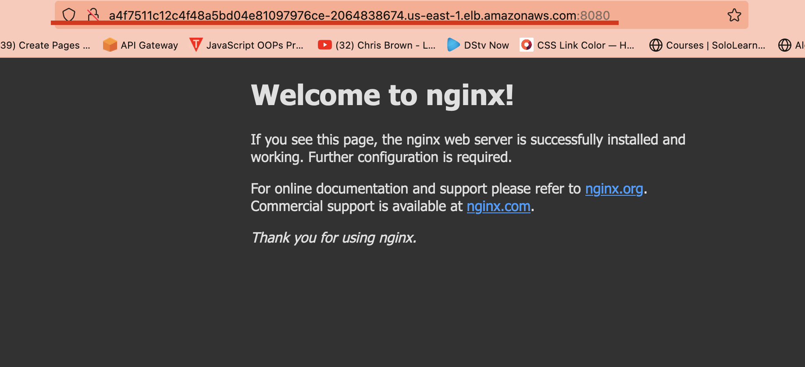

# Eks Management with rancher application using terraform

This is sample nginx application running on aws eks cluster through terraform

## Rancher Management Service

Rancher Management Server are for the following clouds:

- **Amazon Web Services**
- **Microsoft Azure Cloud**
- **DigitalOcean**
- **Google Cloud Platform**
- **Harvester**
- **Hetzner Cloud**
- **Linode**
- **Scaleway**
- **Outscale**

## Requirements - Cloud

- Terraform >=1.0.0
- Credentials for the cloud provider used for the quickstart (aws)
- rancher Server (Running dokerised version of rancher)

### Using cloud quickstarts

To begin with any quickstart, perform the following steps:

1. EKS terraform cluster

- Clone or download this repository to a local folder
- Choose a cloud provider and navigate into the provider's folder under terraform folder
- Run `terraform init`
- Run `terraform apply`

2. EKS Nginx deployment and service using kubectl

- Navigate to the root directory
- Run `kubectl apply -f demo_cluster.yml`
- Run `kubectl get all` for checking deployment update
- Run `kubectl  get  svc` to get external url at port 8080

2. Rancher using docker container

- [Rancher Docs](https://rancher.com/docs/)
- Run `sudo docker run --privileged -d --restart=unless-stopped -p 80:80 -p 443:443 rancher/rancher`
- Run `docker ps` to verify conatiner running state
- Run `docker logs  <- docker-ID ->` to check ruuning update
- Visit browser with localhost to preview, login and connect to eks with url

### Chanllenges

1. Inability to run rancher with terraform
2. inability to connect rancher with cluster

- ranching failing with `CrashloopBackOff`
  

### Remove

When you're finished exploring the Rancher server, use terraform to tear down all resources in the quickstart.
Make sure you tear down any resources you provisioned manually before running the destroy command.

Run `terraform destroy -auto-approve` to remove all resources without prompting for confirmation.
